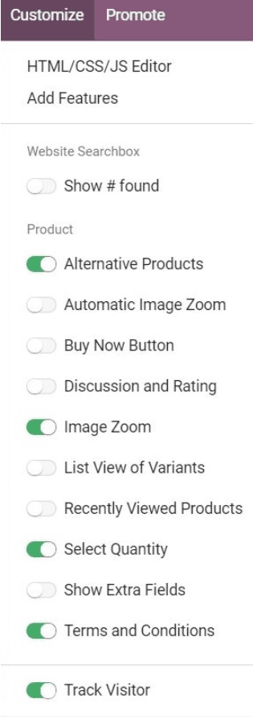

=============
Product pages
=============

An eCommerce store simply isn't complete without products. That's why it's important to make sure
all your product pages look great, and properly present items to potential customers. Thankfully,
with Odoo, building product pages for your online store has never been easier.

Building product pages
======================

On the website, click *New Page* in the top-right corner.

Then click *New Product* and follow the blinking tips.

.. image:: ./media/create_product.png
   :align: center

Here are the main elements of the Product page:

.. image:: ./media/product_page_tips.png
   :align: center

Many elements can be made visible from the *Customize* menu.

See how to configure your products from links here below.

.. seealso::

  * :doc:`../managing_products/variants`
  * :doc:`../../sales/products_prices/taxes`
  * :doc:`../managing_products/stock`
  * :doc:`../maximizing_revenue/cross_selling`
  * :doc:`../maximizing_revenue/reviews`
  * :doc:`../maximizing_revenue/pricing`
  * :doc:`../../website/optimize/seo`
