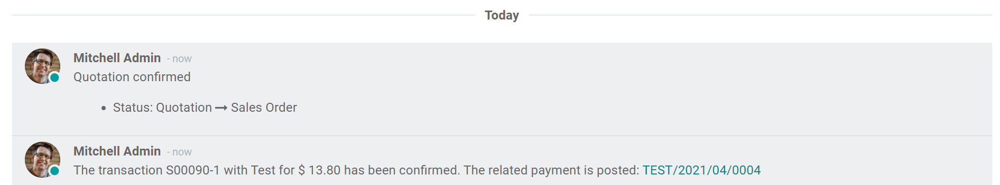
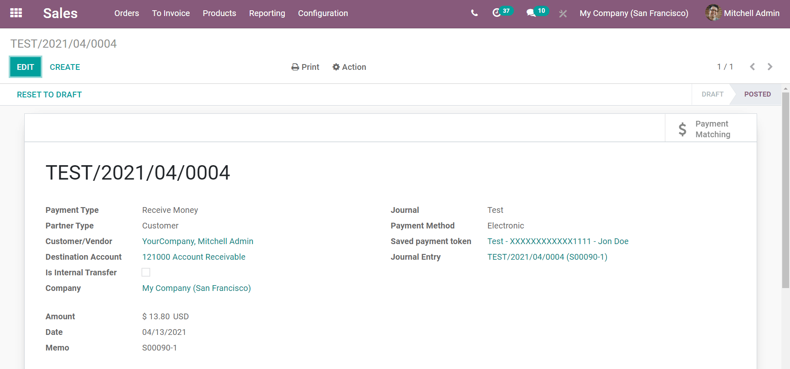
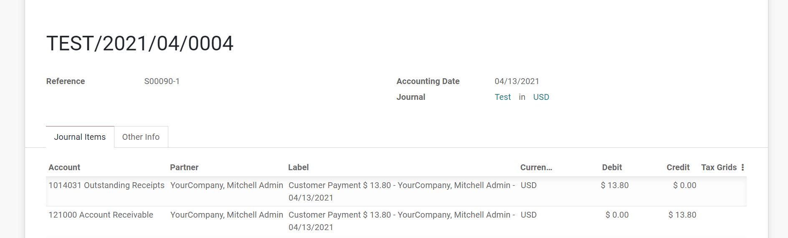

=========================================
Manage orders paid with Payment Acquirers
=========================================

Odoo automatically confirms orders as soon as the payment is authorized 
by a payment acquirer. This triggers the delivery.
If you invoice based on ordered quantities, you are also requested to invoice the order.

Checking the status of a payment
================================
The payment is confirmed with an automatic note in the *Chatter* of the sales order. And, if the
user decides to create an invoice, the payment is directly reconciled.

Clicking on that link will take the user to a page detailing the transaction, along with a link
to the specific journal entry surrounding this transaction.

And, if the user clicks on the link to the journal entry, they will be taken to that journal
entry's page, showcasing all the pertinent details surrounding this specific transaction

.. note:: Specific messages are provided to your customers for every
   payment status whenever they are redirected to Odoo after the transaction.
   To edit these messages, go to the *Messages* tab of the payment
   method.

Automatically generate invoices at order
========================================

When the order is confirmed, you can also have an invoice automatically issued
and paid. This fully-automated feature is designed for businesses that invoice 
orders straight on.

To do this, go to the *Invoicing* section of the *Settings* in the Website application,
and select *Invoice What Is Ordered* and then select *Automatic Invoices*, which will
generate an invoice automatically when the online payment is confirmed.

.. image:: media/automatic-invoice.png
   :align: center
   :alt: example of automatic invoice

.. note::
   If you choose this mode, you are requested to select a payment journal, in order to record 
   payments in your books. This payment is automatically reconciled with the invoice, marking it as
   paid. Select your **bank account** if you get paid immediately on your bank account. If you don't 
   you can create a specific journal for the payment acquirer (type = Bank). That way, you can track
   online payments in an intermediary account of your books until you get paid into your bank
   account (see :doc:`../../general/payment_acquirers/payment_acquirers`).

Capture payment after the delivery
==================================
With this mode (which is only available with Authorize.net), the order is confirmed, 
but the amount is kept on hold. Once the delivery is processed, you can capture the payment from
Odoo.

To learn more about that, simply follow the procedure explained `here <https://www.odoo
.com/documentation/user/14.0/general/payment_acquirers/authorize
.html#capture-the-payment-after-the-delivery>`_.
